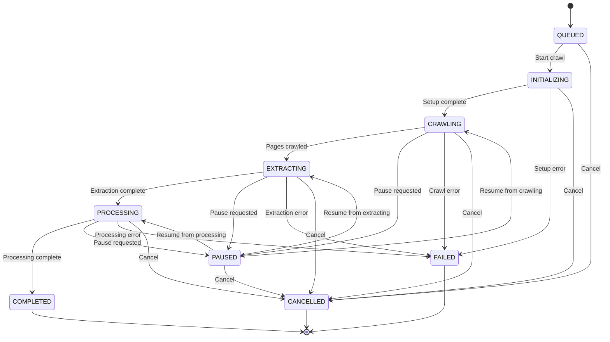
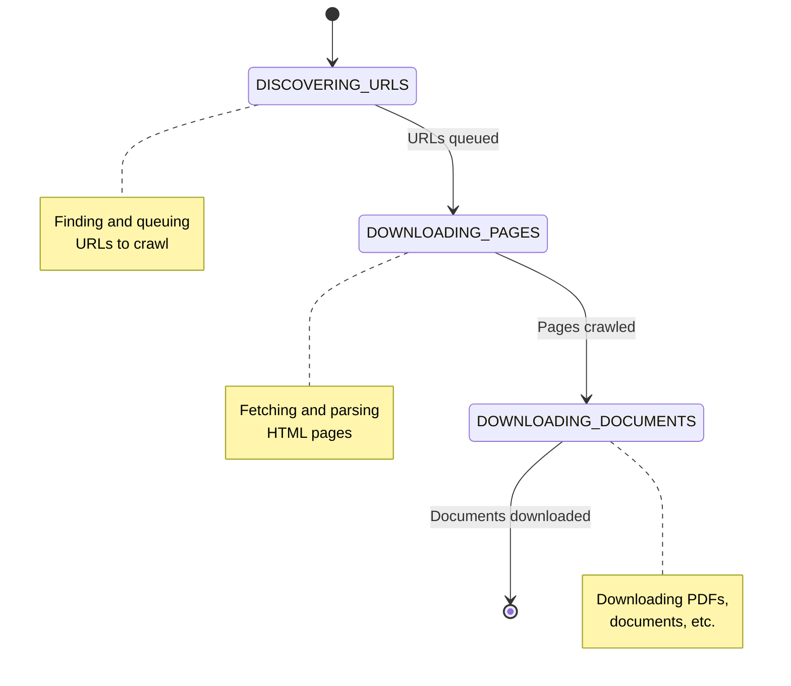
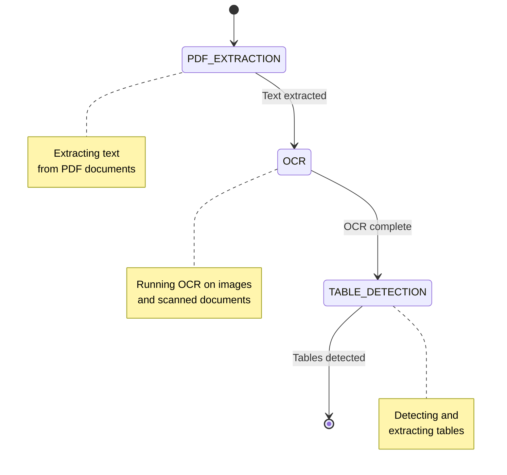
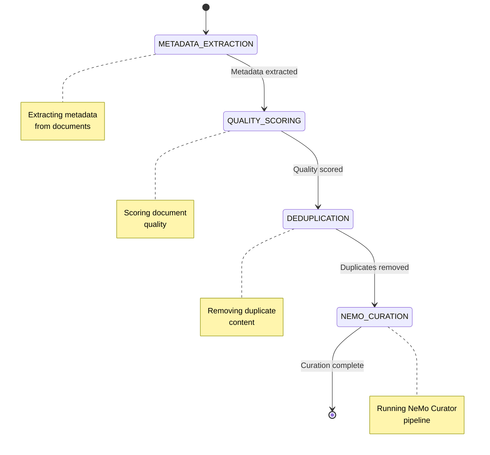
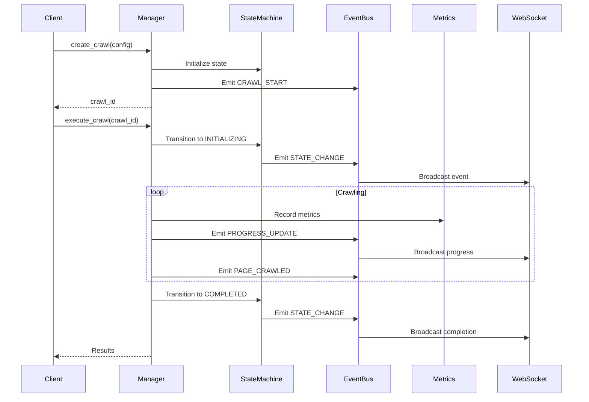
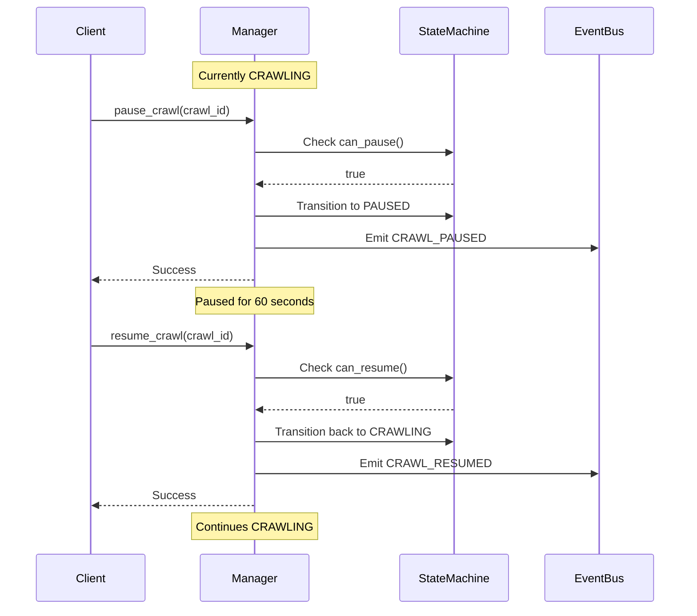
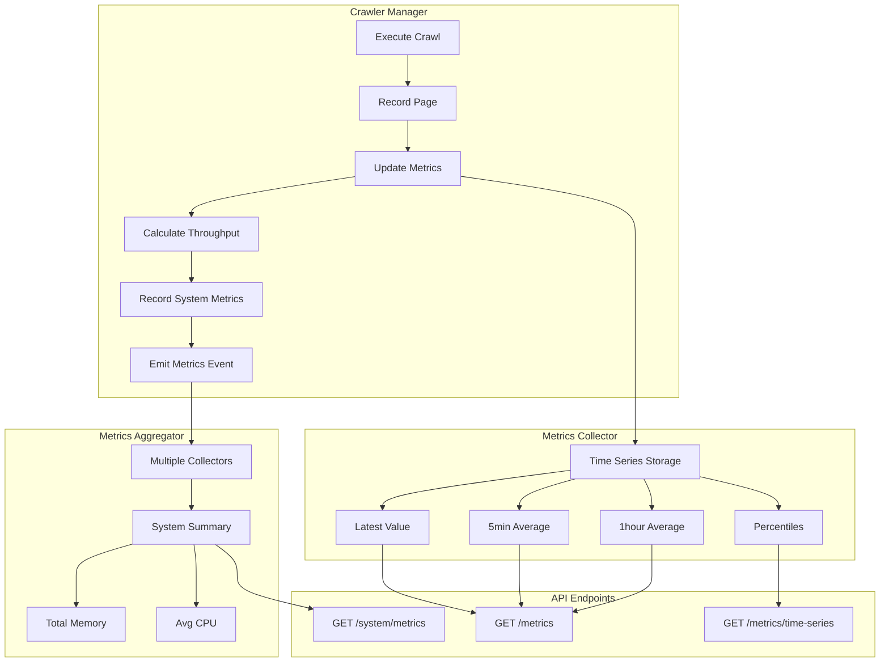
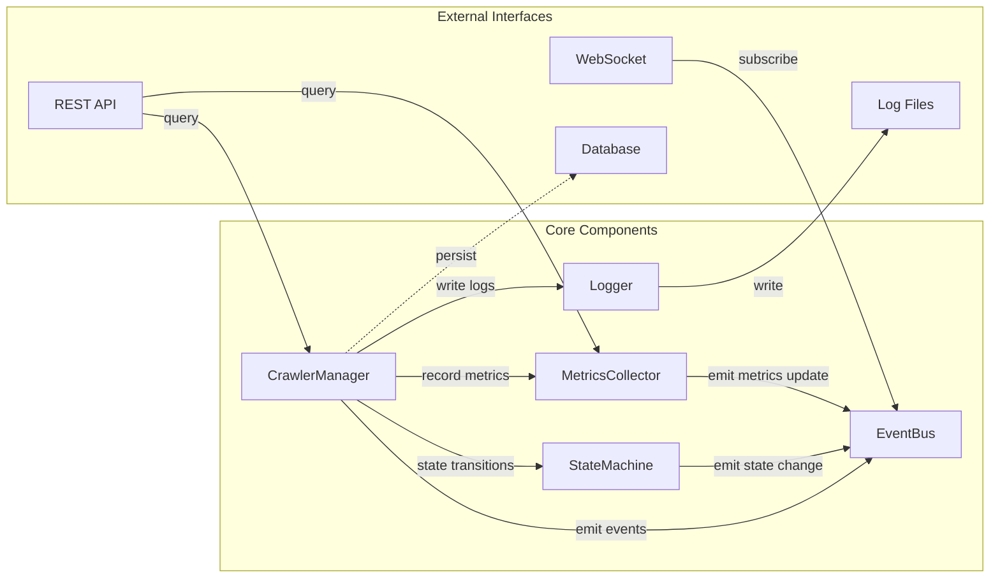
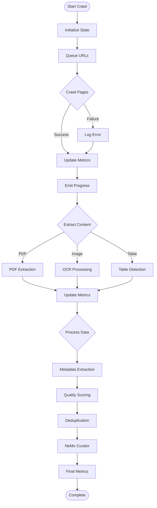
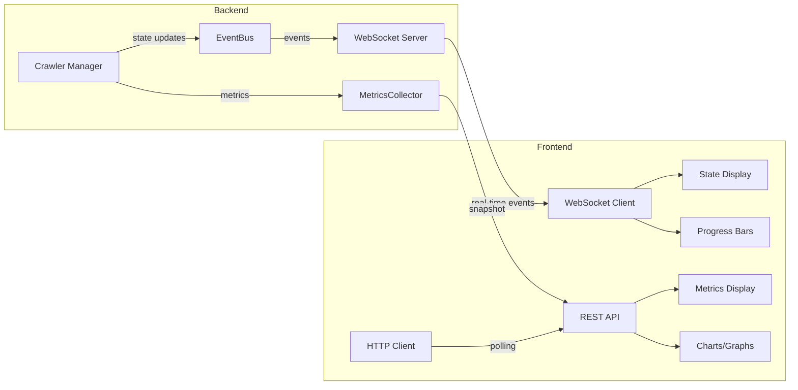

# GenCrawl State Machine Diagrams

## Main State Flow

## CRAWLING Substates

## EXTRACTING Substates

## PROCESSING Substates

## Event Flow

## Pause/Resume Flow

## Metrics Collection Architecture

## Component Interaction

## Data Flow

## Monitoring Dashboard Data Flow

## Legend

### State Types
- **Active States**: Can transition to other states
- **Paused State**: Can resume to previous active state
- **Terminal States**: End of lifecycle (COMPLETED, FAILED, CANCELLED)

### Transition Types
- **Solid Arrow**: Normal transition
- **Dashed Arrow**: Optional/conditional transition

### Components
- **Manager**: Orchestrates crawl execution
- **StateMachine**: Validates and tracks state transitions
- **MetricsCollector**: Collects and stores metrics
- **EventBus**: Publishes events to subscribers
- **Logger**: Writes structured logs

---

Generated: January 20, 2026
Version: 1.0.0
