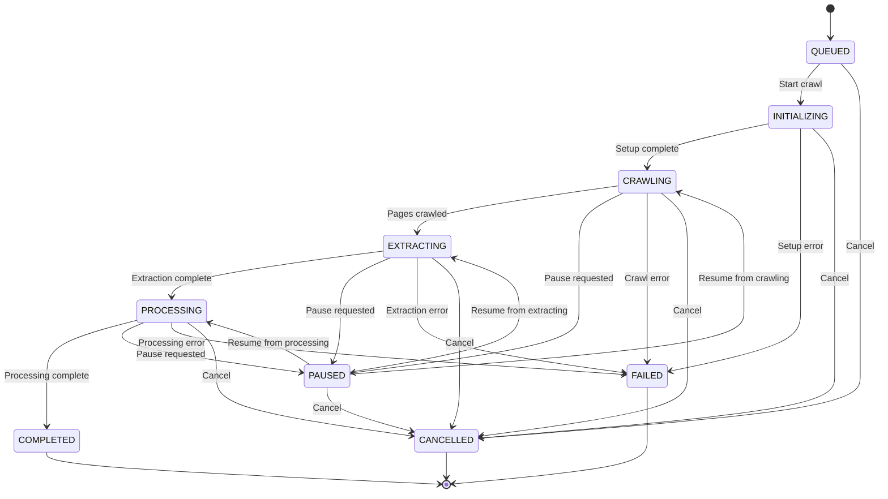
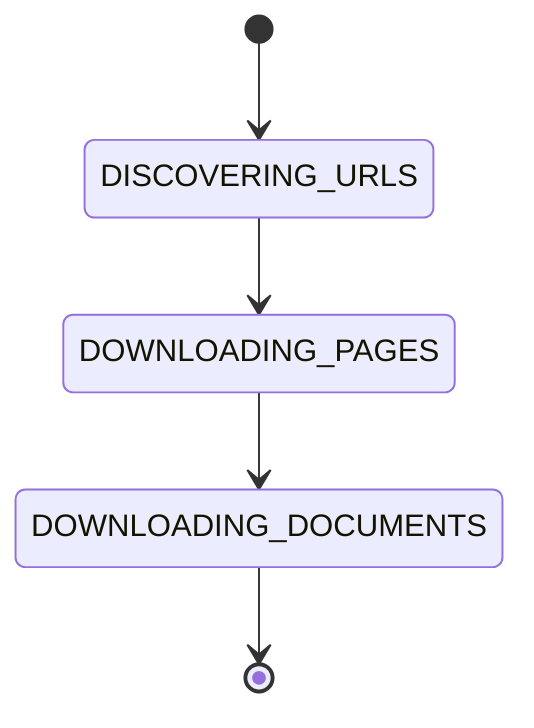
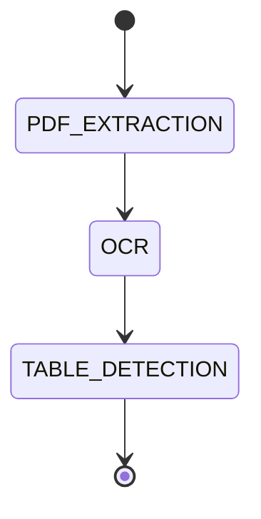
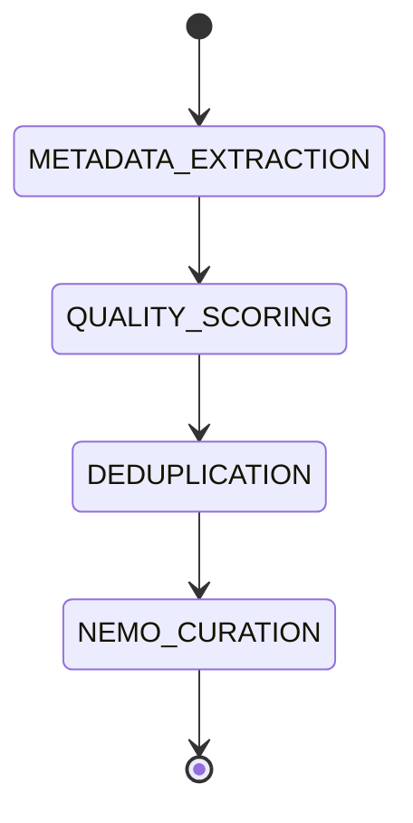

# GenCrawl State Machine and Monitoring System

## Overview

This document describes the comprehensive state machine, metrics collection, and event system implemented for GenCrawl's crawler manager.

## State Machine Architecture

### Main States



### State Descriptions

| State | Description | Can Pause | Can Resume | Terminal |
|-------|-------------|-----------|------------|----------|
| `QUEUED` | Job created, waiting to start | No | No | No |
| `INITIALIZING` | Setting up crawler, loading config | No | No | No |
| `CRAWLING` | Actively crawling pages and downloading documents | Yes | No | No |
| `EXTRACTING` | Extracting content from documents | Yes | No | No |
| `PROCESSING` | Processing, scoring, and curating data | Yes | No | No |
| `PAUSED` | Temporarily paused by user | No | Yes | No |
| `COMPLETED` | Successfully finished all stages | No | No | Yes |
| `FAILED` | Error occurred, job terminated | No | No | Yes |
| `CANCELLED` | User cancelled the job | No | No | Yes |

## Substates

Each main state has specific substates that track detailed progress:

### CRAWLING Substates



- `DISCOVERING_URLS`: Finding and queuing URLs to crawl
- `DOWNLOADING_PAGES`: Fetching and parsing HTML pages
- `DOWNLOADING_DOCUMENTS`: Downloading PDFs, documents, etc.

### EXTRACTING Substates



- `PDF_EXTRACTION`: Extracting text from PDF documents
- `OCR`: Running OCR on images and scanned documents
- `TABLE_DETECTION`: Detecting and extracting tables

### PROCESSING Substates



- `METADATA_EXTRACTION`: Extracting metadata from documents
- `QUALITY_SCORING`: Scoring document quality
- `DEDUPLICATION`: Removing duplicate content
- `NEMO_CURATION`: Running NeMo Curator pipeline

## Progress Tracking

The system tracks progress across four main categories:

```python
{
    "urls": {
        "total": 1000,
        "completed": 850,
        "failed": 50,
        "percentage": 85.0
    },
    "documents": {
        "total": 200,
        "completed": 180,
        "percentage": 90.0
    },
    "extractions": {
        "total": 180,
        "completed": 175,
        "percentage": 97.2
    },
    "processing": {
        "total": 175,
        "completed": 100,
        "percentage": 57.1
    }
}
```

## Metrics Collection

### Real-time Metrics

The system collects comprehensive metrics in real-time:

#### Throughput Metrics
- `pages_per_second` - Page crawl rate
- `pages_per_minute` - Page crawl rate (minute window)
- `documents_per_second` - Document download rate

#### Performance Metrics
- `download_speed_mbps` - Download bandwidth usage
- `avg_page_time` - Average time per page
- `avg_extraction_time` - Average extraction time

#### Success Metrics
- `success_rate` - Percentage of successful operations
- `error_rate` - Percentage of failed operations

#### Quality Metrics
- `quality_score` - Average quality score
- `quality_pass_rate` - Percentage passing quality threshold

#### Resource Metrics
- `memory_usage_mb` - Memory consumption
- `cpu_usage_percent` - CPU utilization
- `thread_count` - Active thread count

#### Queue Metrics
- `queue_size` - Items waiting in queue
- `active_tasks` - Currently active tasks

### Metric Aggregations

Metrics support multiple aggregation windows:

- **Latest**: Most recent value
- **5-minute**: Average over last 5 minutes
- **1-hour**: Average over last hour
- **Percentiles**: P50, P95, P99 for latency analysis

## Event System

### Event Types

The event bus supports the following event types:

#### State Events
- `STATE_CHANGE` - Main state transition
- `SUBSTATE_CHANGE` - Substate transition

#### Progress Events
- `PROGRESS_UPDATE` - Progress percentage update
- `MILESTONE_REACHED` - Major milestone achieved

#### Document Events
- `DOCUMENT_FOUND` - New document discovered
- `DOCUMENT_DOWNLOADED` - Document downloaded
- `DOCUMENT_PROCESSED` - Document processing complete

#### Extraction Events
- `EXTRACTION_STARTED` - Extraction began
- `EXTRACTION_COMPLETE` - Extraction finished
- `EXTRACTION_FAILED` - Extraction error

#### Quality Events
- `QUALITY_ASSESSED` - Quality score calculated
- `QUALITY_THRESHOLD_PASSED` - Quality check passed
- `QUALITY_THRESHOLD_FAILED` - Quality check failed

#### Page Events
- `PAGE_CRAWLED` - Page successfully crawled
- `PAGE_FAILED` - Page crawl failed

#### Error Events
- `ERROR` - Error occurred
- `WARNING` - Warning issued

#### System Events
- `METRICS_UPDATE` - Metrics snapshot
- `CRAWL_PAUSED` - Crawl paused
- `CRAWL_RESUMED` - Crawl resumed
- `CRAWL_CANCELLED` - Crawl cancelled
- `CRAWL_COMPLETED` - Crawl completed

### Event Structure

```json
{
    "event_id": "uuid",
    "crawl_id": "crawl-uuid",
    "event_type": "STATE_CHANGE",
    "timestamp": "2026-01-20T12:34:56.789Z",
    "data": {
        "from_state": "CRAWLING",
        "to_state": "EXTRACTING"
    },
    "metadata": {
        "duration_seconds": 123.45
    }
}
```

## API Endpoints

### State Management

#### `GET /api/v1/crawl/{crawl_id}/state`
Get current state and substates.

**Response:**
```json
{
    "crawl_id": "uuid",
    "current_state": "CRAWLING",
    "current_substate": "DOWNLOADING_PAGES",
    "progress": {...},
    "metrics": {...},
    "can_pause": true,
    "can_resume": false,
    "is_terminal": false,
    "state_history": [...]
}
```

#### `GET /api/v1/crawl/{crawl_id}/status`
Get comprehensive status summary.

**Response:**
```json
{
    "crawl_id": "uuid",
    "current_state": "CRAWLING",
    "duration_seconds": 456.78,
    "overall_progress": 45.2,
    "is_terminal": false,
    "can_pause": true,
    "metrics": {...}
}
```

### Metrics

#### `GET /api/v1/crawl/{crawl_id}/metrics`
Get real-time metrics snapshot.

**Query Parameters:**
- `window_seconds` (default: 300) - Time window for aggregation
- `aggregated` (default: false) - Return aggregated metrics

**Response:**
```json
{
    "crawl_id": "uuid",
    "timestamp": "2026-01-20T12:34:56.789Z",
    "uptime_seconds": 456.78,
    "metrics": {
        "pages_per_second": {
            "latest": 5.2,
            "avg_5min": 4.8,
            "avg_1hour": 5.1,
            "p95": 6.3,
            "unit": "pages/s"
        }
    }
}
```

#### `GET /api/v1/crawl/{crawl_id}/metrics/time-series`
Get time series data for specific metric.

**Query Parameters:**
- `metric_name` (required) - Metric to retrieve
- `window_seconds` (default: 300) - Time window
- `limit` (default: 100) - Max data points

**Response:**
```json
{
    "metric": "pages_per_second",
    "unit": "pages/s",
    "window_seconds": 300,
    "point_count": 50,
    "points": [
        {"timestamp": "2026-01-20T12:30:00Z", "value": 4.5},
        {"timestamp": "2026-01-20T12:31:00Z", "value": 5.2}
    ]
}
```

#### `GET /api/v1/crawl/{crawl_id}/performance`
Get performance summary with key metrics.

**Response:**
```json
{
    "crawl_id": "uuid",
    "throughput": {
        "pages_per_second": 5.2,
        "pages_per_minute": 312,
        "avg_page_time": 0.19
    },
    "success": {
        "success_rate": 95.5,
        "error_rate": 4.5
    },
    "quality": {
        "avg_quality_score": 0.82,
        "quality_pass_rate": 87.3
    },
    "resources": {
        "memory_mb": 512.5,
        "cpu_percent": 45.2,
        "threads": 12
    }
}
```

### Events

#### `GET /api/v1/crawl/{crawl_id}/events`
Get event history.

**Query Parameters:**
- `limit` (default: 100) - Max events to return
- `event_type` (optional) - Filter by event type
- `since` (optional) - ISO timestamp to filter from

**Response:**
```json
{
    "crawl_id": "uuid",
    "event_count": 50,
    "events": [
        {
            "event_id": "uuid",
            "event_type": "PAGE_CRAWLED",
            "timestamp": "2026-01-20T12:34:56.789Z",
            "data": {"url": "https://example.com", "success": true},
            "metadata": {}
        }
    ]
}
```

#### `WebSocket /api/v1/crawl/{crawl_id}/ws`
Real-time event stream via WebSocket.

**Client Message:**
```json
{"type": "ping"}
```

**Server Messages:**
```json
{
    "event_id": "uuid",
    "crawl_id": "uuid",
    "event_type": "PROGRESS_UPDATE",
    "timestamp": "2026-01-20T12:34:56.789Z",
    "data": {...}
}
```

### Control Operations

#### `POST /api/v1/crawl/{crawl_id}/pause`
Pause a running crawl.

**Response:**
```json
{
    "crawl_id": "uuid",
    "status": "paused",
    "message": "Crawl paused successfully"
}
```

#### `POST /api/v1/crawl/{crawl_id}/resume`
Resume a paused crawl.

**Response:**
```json
{
    "crawl_id": "uuid",
    "status": "resumed",
    "message": "Crawl resumed successfully"
}
```

#### `POST /api/v1/crawl/{crawl_id}/cancel`
Cancel a crawl job.

**Response:**
```json
{
    "crawl_id": "uuid",
    "status": "cancelled",
    "message": "Crawl cancelled successfully"
}
```

### Estimates

#### `GET /api/v1/crawl/{crawl_id}/estimate`
Get estimated completion time.

**Response:**
```json
{
    "crawl_id": "uuid",
    "estimated_completion": "2026-01-20T15:30:00Z",
    "progress_percentage": 45.2,
    "total_items": 1000,
    "completed_items": 452,
    "remaining_items": 548
}
```

### System-wide

#### `GET /api/v1/system/metrics`
Get system-wide metrics across all crawls.

**Response:**
```json
{
    "active_crawls": 3,
    "total_memory_mb": 1536.5,
    "avg_cpu_percent": 42.1,
    "crawl_ids": ["uuid1", "uuid2", "uuid3"]
}
```

## Usage Examples

### Creating and Monitoring a Crawl

```python
from crawlers.manager import CrawlerManager
from events.event_bus import event_bus, EventType
import asyncio

# Initialize manager
manager = CrawlerManager()

# Create crawl job
config = {
    "crawler": "scrapy",
    "targets": ["https://example.com"],
    "strategy": "bfs"
}
crawl_id = manager.create_crawl(config, user_id="user123")

# Subscribe to events
async def on_event(event):
    print(f"Event: {event.event_type} - {event.data}")

event_bus.subscribe(crawl_id, on_event)

# Execute crawl
await manager.execute_crawl(crawl_id)

# Check final status
status = manager.get_status(crawl_id)
print(f"Final state: {status['current_state']}")
```

### Pausing and Resuming

```python
# Pause crawl
await manager.pause_crawl(crawl_id)

# Wait for some condition
await asyncio.sleep(60)

# Resume crawl
await manager.resume_crawl(crawl_id)
```

### Monitoring Metrics

```python
# Get current metrics
metrics = manager.get_metrics(crawl_id)
print(f"Pages/sec: {metrics['metrics']['pages_per_second']['latest']}")

# Get performance summary
perf = manager.metrics_aggregator.collectors[crawl_id].get_performance_summary()
print(f"Success rate: {perf['success']['success_rate']}%")
```

### WebSocket Client Example

```javascript
const ws = new WebSocket('ws://localhost:8000/api/v1/crawl/uuid/ws');

ws.onmessage = (event) => {
    const data = JSON.parse(event.data);
    console.log('Event:', data.event_type, data.data);

    if (data.event_type === 'PROGRESS_UPDATE') {
        updateProgressBar(data.data.overall_percentage);
    }
};

// Send ping
setInterval(() => {
    ws.send('ping');
}, 30000);
```

## Architecture Notes

### Singleton Manager

In production, the `CrawlerManager` should be a singleton:

```python
# main.py
from crawlers.manager import CrawlerManager

# Global manager instance
crawler_manager = CrawlerManager()

# Dependency injection in FastAPI
def get_manager():
    return crawler_manager
```

### Database Persistence

The current implementation uses in-memory storage. For production:

1. Store `CrawlStateData` in PostgreSQL/MongoDB
2. Use Redis for real-time metrics
3. Store event history in a time-series database (InfluxDB, TimescaleDB)

### Scaling Considerations

- **Multiple workers**: Use Redis for shared state
- **Distributed crawling**: Implement state synchronization
- **Event broadcasting**: Use Redis Pub/Sub or RabbitMQ
- **Metrics aggregation**: Use Prometheus/Grafana

## File Structure

```
backend/
├── models/
│   └── crawl_state.py        # State machine models
├── utils/
│   ├── logger.py             # Logging utility
│   └── metrics.py            # Metrics collection
├── events/
│   ├── __init__.py
│   └── event_bus.py          # Event system
├── crawlers/
│   └── manager.py            # Enhanced crawler manager
└── api/
    └── routers/
        └── monitoring.py     # API endpoints
```

## Dependencies

Add to `pyproject.toml`:

```toml
[project]
dependencies = [
    "fastapi",
    "websockets",
    "pydantic>=2.0",
    "psutil",  # For system metrics
]
```

## Testing

See `tests/test_state_machine.py` for unit tests covering:
- State transitions
- Pause/resume functionality
- Event emission
- Metrics collection
- API endpoints

## Future Enhancements

1. **Checkpointing**: Save state for crash recovery
2. **Rate limiting**: Per-domain rate limits in state
3. **Priority queues**: Priority-based crawling
4. **Distributed locks**: For multi-worker coordination
5. **Alerting**: Webhook/email notifications on events
6. **Historical analytics**: Long-term metrics storage and analysis

## License

Part of GenCrawl - Document Crawler and Curation System
