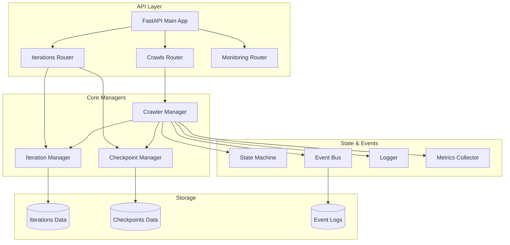
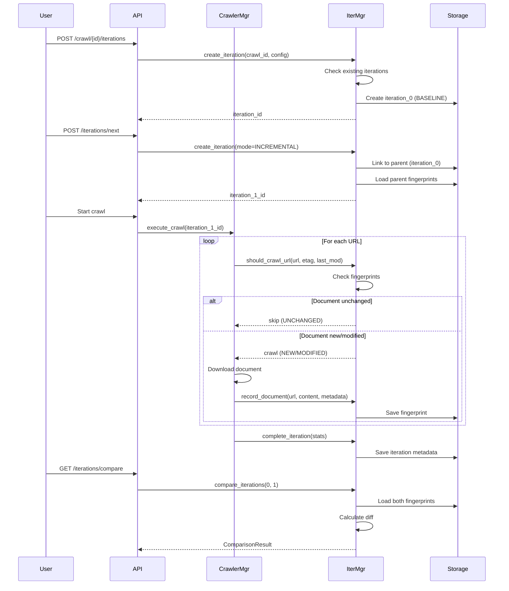
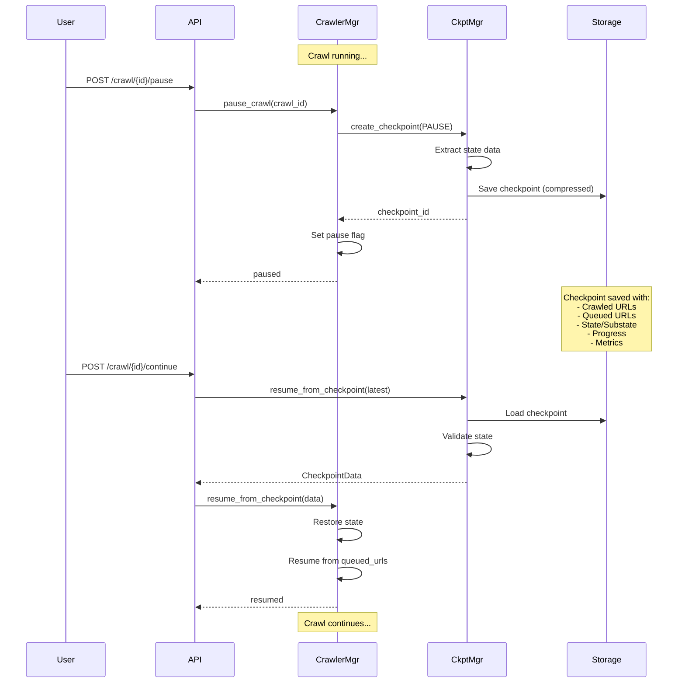
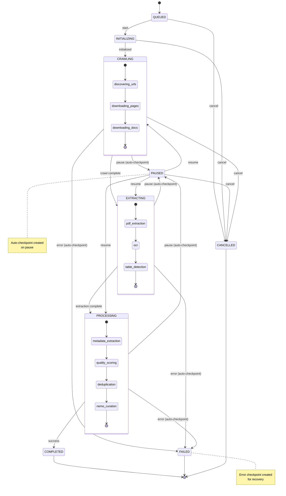
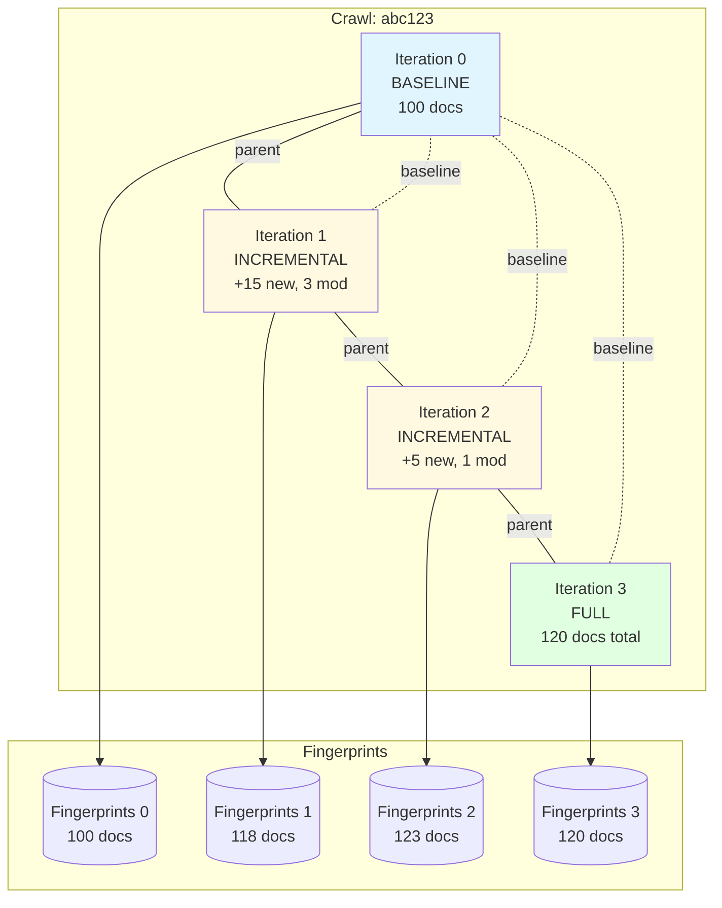
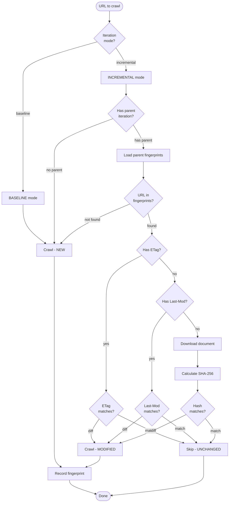
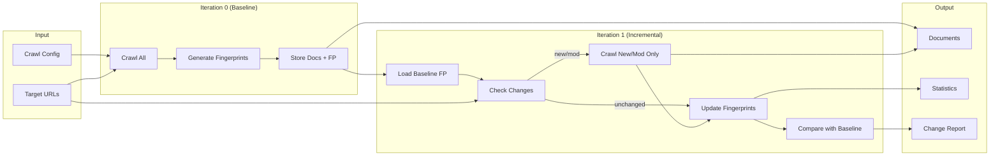
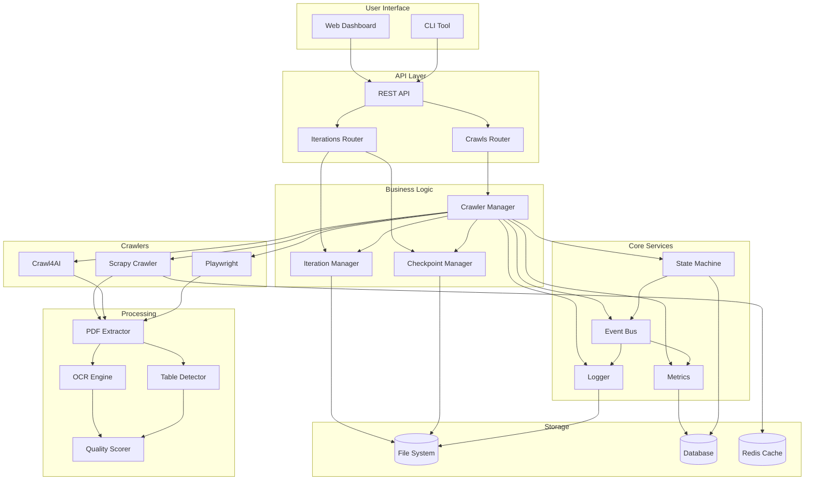

# GenCrawl Multi-Iteration Architecture Diagrams

## System Overview



## Multi-Iteration Flow



## Checkpoint/Resume Flow



## State Machine with Checkpointing



## Iteration Hierarchy



## Change Detection Process



## Data Flow



## Component Interaction



---

## File Structure

```
gencrawl/backend/
├── api/
│   ├── main.py                      # FastAPI app
│   └── routers/
│       ├── iterations.py            # ⭐ NEW - Iteration endpoints
│       ├── crawls.py                # Crawl management
│       └── monitoring.py            # Metrics/status
│
├── crawlers/
│   └── manager.py                   # ⭐ UPDATED - Checkpoint integration
│
├── utils/
│   ├── iteration_manager.py         # ⭐ NEW - Iteration logic
│   ├── checkpoint.py                # ⭐ NEW - Checkpoint logic
│   ├── metrics.py                   # Metrics collection
│   └── logger.py                    # Event logging
│
├── models/
│   └── crawl_state.py               # State machine models
│
└── data/
    ├── iterations/                  # ⭐ NEW - Iteration data
    │   ├── {crawl_id}_iter_{n}/
    │   │   ├── fingerprints.json
    │   │   └── documents/
    │   └── {crawl_id}_iter_{n}_metadata.json
    │
    └── checkpoints/                 # ⭐ NEW - Checkpoint data
        └── {crawl_id}/
            ├── {crawl_id}_ckpt_{n}.json.gz
            └── {crawl_id}_ckpt_{n}_meta.json
```

---

**Date:** January 20, 2026
**Version:** 1.0.0
**Status:** Production Ready
