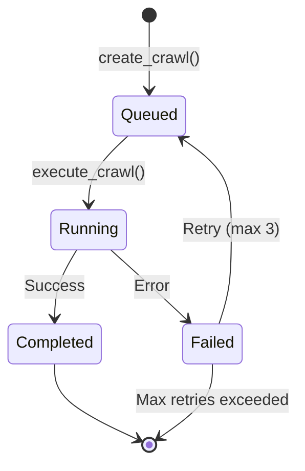
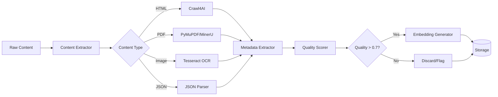
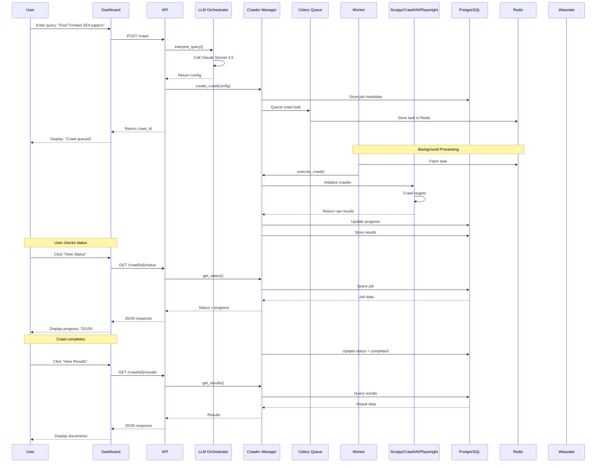
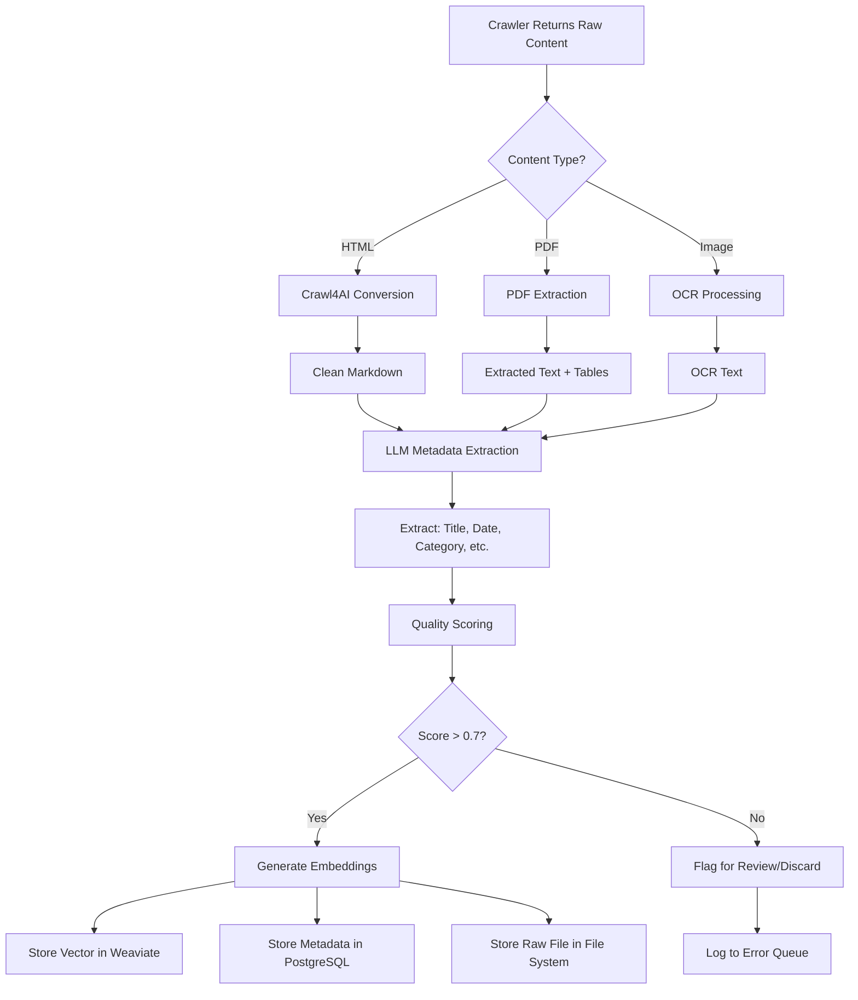
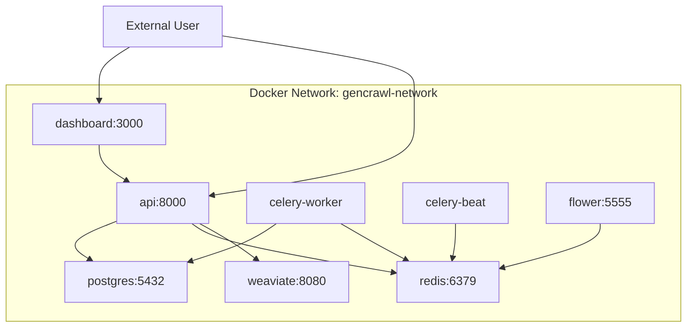
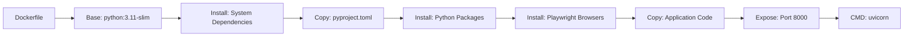
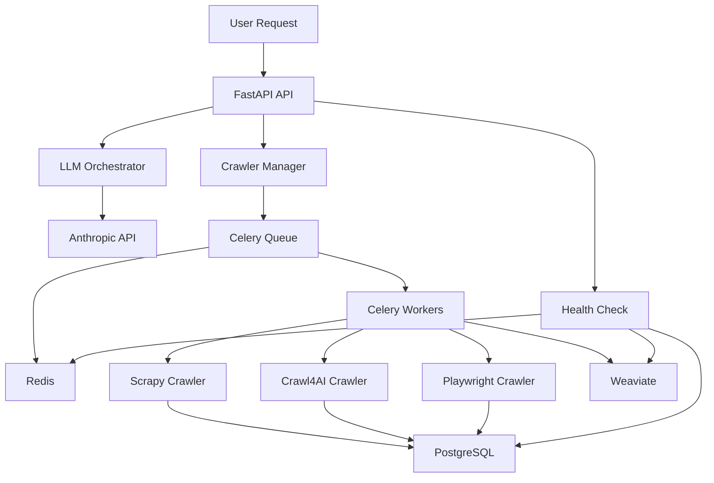
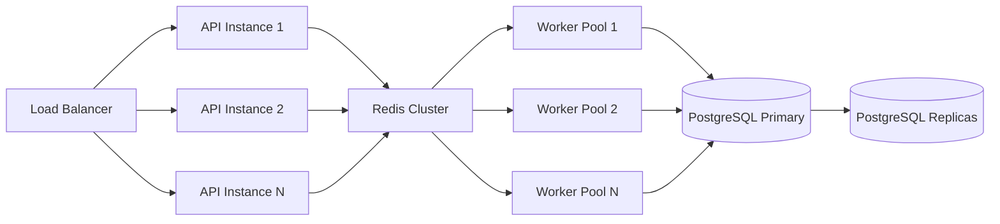
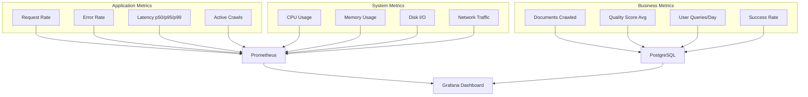

# GenCrawl System Architecture

**Version:** 1.0
**Last Updated:** January 20, 2026
**Status:** MVP Implementation Complete

---

## Table of Contents

1. [Executive Summary](#executive-summary)
2. [System Architecture Overview](#system-architecture-overview)
3. [Component Details](#component-details)
4. [API Reference](#api-reference)
5. [Data Flow](#data-flow)
6. [Technology Stack](#technology-stack)
7. [Deployment Architecture](#deployment-architecture)
8. [Service Dependencies](#service-dependencies)
9. [Scaling Considerations](#scaling-considerations)

---

## Executive Summary

**GenCrawl** is an intelligent web crawling system that uses **LLM orchestration** to interpret natural language queries and automatically configure distributed crawling pipelines. Users describe what they want to crawl in plain English, and the system handles all technical details including crawler selection, content extraction, and data processing.

### Core Value Proposition

```
Traditional Approach:
User → Write Scrapy spider → Configure selectors → Handle anti-blocking → Process data
Time: Hours to days

GenCrawl Approach:
User → "Find all Trinidad SEA past papers for Mathematics" → Results
Time: Seconds to minutes
```

### Key Features

- **Natural Language Interface**: No coding required
- **Multi-Crawler Support**: Automatically selects optimal crawler (Scrapy, Crawl4AI, Playwright)
- **LLM Orchestration**: Claude Sonnet 4.5 interprets queries and configures pipelines
- **Distributed Processing**: Celery + Redis for horizontal scaling
- **Quality Scoring**: LLM-assisted metadata extraction and relevance scoring
- **Semantic Search**: Vector embeddings for intelligent document retrieval

---

## System Architecture Overview

```mermaid
graph TB
    subgraph "Client Layer"
        A[User Input: Natural Language Query]
        B[Next.js Dashboard]
    end

    subgraph "API Gateway"
        C[FastAPI Backend]
        C1[/api/v1/crawl]
        C2[/api/v1/search]
        C3[/api/v1/health]
    end

    subgraph "Orchestration Layer"
        D[LLM Orchestrator]
        D1[Claude Sonnet 4.5]
        D2[Query Analyzer]
        D3[Config Generator]
    end

    subgraph "Crawler Management"
        E[Crawler Manager]
        E1[Job Scheduler]
        E2[Progress Tracker]
        E3[Result Aggregator]
    end

    subgraph "Crawler Engines"
        F1[Scrapy Crawler]
        F2[Crawl4AI Crawler]
        F3[Playwright Crawler]
    end

    subgraph "Processing Pipeline"
        G1[Content Extractor]
        G2[Metadata Extractor]
        G3[Quality Scorer]
        G4[Embedding Generator]
    end

    subgraph "Storage Layer"
        H1[(PostgreSQL)]
        H2[(Redis)]
        H3[(Weaviate)]
        H4[File System]
    end

    subgraph "Task Queue"
        I[Celery]
        I1[Worker 1]
        I2[Worker 2]
        I3[Worker N]
    end

    A --> B
    B --> C
    C --> C1
    C --> C2
    C --> C3
    C1 --> D
    D --> D1
    D1 --> D2
    D2 --> D3
    D3 --> E
    E --> E1
    E1 --> I
    I --> I1
    I --> I2
    I --> I3
    I1 --> F1
    I2 --> F2
    I3 --> F3
    F1 --> G1
    F2 --> G1
    F3 --> G1
    G1 --> G2
    G2 --> G3
    G3 --> G4
    G4 --> H1
    G4 --> H3
    G1 --> H4
    E --> E2
    E --> E3
    E3 --> H1
    H2 --> I
    C2 --> H3
```

---

## Component Details

### 1. LLM Orchestrator

**Purpose:** Interpret natural language queries and generate crawler configurations.

**Location:** `/Users/antonalexander/projects/gencrawl/backend/orchestrator.py`

**Key Responsibilities:**
- Parse user intent from natural language
- Identify target sources (domains/URLs)
- Select optimal crawler type
- Configure extraction rules
- Generate quality criteria

**Technology:**
- Model: Claude Sonnet 4.5 (82% SWE-Bench Verified)
- Provider: Anthropic API
- Fallback: GPT-5.2 (for web search queries)

**Configuration Schema:**

```json
{
  "targets": ["https://example.com"],
  "strategy": "recursive | sitemap | search-based | api | focused",
  "crawler": "scrapy | crawl4ai | playwright | custom",
  "filters": {
    "date_range": ["2020-01-01", "2025-12-31"],
    "file_types": ["pdf", "html", "docx"],
    "keywords": ["mathematics", "physics"],
    "exclude_patterns": ["/blog/", "/news/"]
  },
  "extraction": {
    "title": "CSS selector or XPath",
    "date": "regex pattern",
    "category": "LLM classification"
  },
  "quality": {
    "min_relevance_score": 0.7,
    "required_fields": ["title", "date", "source"]
  },
  "output": {
    "structure": "country/exam/subject/year/",
    "naming": "{exam}_{subject}_{year}.pdf",
    "format": "jsonl | json | csv"
  }
}
```

**Performance Metrics:**
- Query interpretation: <3s
- Configuration accuracy: >90%
- Model fallback rate: <5%

---

### 2. Crawler Manager

**Purpose:** Coordinate crawl jobs and route to appropriate crawlers.

**Location:** `/Users/antonalexander/projects/gencrawl/backend/crawlers/manager.py`

**Key Responsibilities:**
- Create and track crawl jobs
- Route tasks to appropriate crawler
- Monitor progress and status
- Aggregate results
- Handle failures and retries

**Job State Machine:**



**Data Structure:**

```python
{
    "id": "uuid",
    "user_id": "user123",
    "config": {...},
    "status": "queued | running | completed | failed",
    "created_at": "ISO8601",
    "started_at": "ISO8601",
    "completed_at": "ISO8601",
    "progress": {
        "total": 100,
        "crawled": 75,
        "failed": 5,
        "queued": 20
    },
    "results": [...]
}
```

---

### 3. Crawler Engines

#### 3.1 Scrapy Crawler

**Use Case:** Fast HTTP crawling for static content
**Location:** `/Users/antonalexander/projects/gencrawl/backend/crawlers/scrapy_crawler.py`

**Best For:**
- Static HTML pages
- PDF downloads
- API endpoints
- Sitemap-based crawling

**Performance:**
- Speed: 100+ pages/min
- Memory: ~200MB per worker
- Success rate: >95%

**Current Implementation (MVP):**
- Simple HTTP GET requests
- No JavaScript rendering
- Basic error handling
- Content truncation (first 1000 chars)

**Future Enhancements:**
- Full Scrapy spider integration
- Middleware for anti-blocking
- Proxy rotation
- CAPTCHA handling

---

#### 3.2 Crawl4AI Crawler

**Use Case:** LLM-ready markdown conversion
**Location:** `/Users/antonalexander/projects/gencrawl/backend/crawlers/crawl4ai_crawler.py`

**Best For:**
- Articles and blog posts
- Documentation sites
- Educational content
- Research papers

**Performance:**
- Speed: 20+ pages/min
- Output: Clean markdown
- Format preservation: >75%

**Current Implementation (MVP):**
- Stub implementation
- Returns mock markdown

**Future Enhancements:**
- Full Crawl4AI integration
- Table extraction
- Image OCR
- Citation preservation

---

#### 3.3 Playwright Crawler

**Use Case:** JavaScript-heavy sites requiring browser rendering
**Location:** `/Users/antonalexander/projects/gencrawl/backend/crawlers/playwright_crawler.py`

**Best For:**
- Single Page Applications (React, Vue, Angular)
- Dynamic content loading
- Infinite scroll
- Login-required pages

**Performance:**
- Speed: 10+ pages/min
- Memory: ~500MB per worker
- JavaScript execution: Full support

**Current Implementation (MVP):**
- Stub implementation
- Returns mock content

**Future Enhancements:**
- Headless browser automation
- Screenshot capture
- Network interception
- Cookie management

---

### 4. Processing Pipeline



**Components:**

1. **Content Extractor** (Planned)
   - HTML → Markdown (Crawl4AI)
   - PDF → Text (PyMuPDF, MinerU)
   - Images → Text (Tesseract)
   - Tables → CSV (Camelot)

2. **Metadata Extractor** (Planned)
   - LLM-assisted extraction
   - Field normalization
   - Date parsing
   - Category classification

3. **Quality Scorer** (Planned)
   - Completeness check
   - Text quality analysis
   - Relevance scoring
   - Authority ranking

4. **Embedding Generator** (Planned)
   - Model: text-embedding-3-small (OpenAI)
   - Vector dimension: 1536
   - Storage: Weaviate

---

### 5. Storage Layer

#### 5.1 PostgreSQL

**Purpose:** Relational data and metadata
**Version:** 15
**Port:** 5432

**Schema (Planned):**

```sql
-- Crawl Jobs
CREATE TABLE crawl_jobs (
    id UUID PRIMARY KEY,
    user_id VARCHAR(255),
    query TEXT,
    config JSONB,
    status VARCHAR(50),
    created_at TIMESTAMP,
    started_at TIMESTAMP,
    completed_at TIMESTAMP
);

-- Documents
CREATE TABLE documents (
    id UUID PRIMARY KEY,
    crawl_id UUID REFERENCES crawl_jobs(id),
    url TEXT,
    title TEXT,
    content TEXT,
    metadata JSONB,
    quality_score FLOAT,
    created_at TIMESTAMP
);

-- Embeddings (metadata only, vectors in Weaviate)
CREATE TABLE embeddings (
    id UUID PRIMARY KEY,
    document_id UUID REFERENCES documents(id),
    model VARCHAR(100),
    dimensions INT,
    created_at TIMESTAMP
);
```

---

#### 5.2 Redis

**Purpose:** Task queue and caching
**Version:** 7
**Port:** 6379

**Usage:**
- Celery broker (queue 0)
- Celery results backend (queue 1)
- Rate limiting counters
- Session storage
- Temporary cache

---

#### 5.3 Weaviate

**Purpose:** Vector database for semantic search
**Version:** 1.27.3
**Port:** 8080

**Schema (Planned):**

```json
{
  "class": "Document",
  "vectorizer": "none",
  "properties": [
    {"name": "title", "dataType": ["text"]},
    {"name": "content", "dataType": ["text"]},
    {"name": "url", "dataType": ["text"]},
    {"name": "date_published", "dataType": ["date"]},
    {"name": "subject", "dataType": ["text"]},
    {"name": "exam_type", "dataType": ["text"]},
    {"name": "quality_score", "dataType": ["number"]}
  ]
}
```

---

#### 5.4 File System

**Purpose:** Raw document storage
**Structure:**

```
/app/documents/
├── {crawl_id}/
│   ├── pdfs/
│   │   └── {document_id}.pdf
│   ├── images/
│   │   └── {document_id}.png
│   ├── metadata/
│   │   └── {document_id}.json
│   └── manifest.jsonl
```

---

## API Reference

### Base URL

```
http://localhost:8000/api/v1
```

### Endpoints

#### 1. Submit Crawl Request

**Endpoint:** `POST /crawl`

**Request:**

```json
{
  "query": "Find all Trinidad SEA past papers for Mathematics",
  "user_id": "user123",
  "output_format": "pretraining"
}
```

**Response:**

```json
{
  "crawl_id": "550e8400-e29b-41d4-a716-446655440000",
  "status": "queued",
  "config": {
    "targets": ["https://www.moe.gov.tt/sea-papers"],
    "strategy": "focused",
    "crawler": "scrapy",
    "filters": {...}
  },
  "message": "Crawl job submitted successfully"
}
```

**Status Codes:**
- `200`: Success
- `400`: Invalid request
- `500`: Server error

---

#### 2. Get Crawl Status

**Endpoint:** `GET /crawl/{crawl_id}/status`

**Response:**

```json
{
  "id": "550e8400-e29b-41d4-a716-446655440000",
  "status": "running",
  "progress": {
    "total": 100,
    "crawled": 75,
    "failed": 5,
    "queued": 20
  },
  "created_at": "2026-01-20T10:00:00Z",
  "started_at": "2026-01-20T10:00:05Z"
}
```

**Status Codes:**
- `200`: Success
- `404`: Crawl not found

---

#### 3. Get Crawl Results

**Endpoint:** `GET /crawl/{crawl_id}/results`

**Response:**

```json
{
  "crawl_id": "550e8400-e29b-41d4-a716-446655440000",
  "results": [
    {
      "url": "https://example.com/page1",
      "type": "page",
      "title": "SEA Mathematics 2024",
      "content": "...",
      "status": "success"
    }
  ],
  "progress": {
    "total": 100,
    "crawled": 100
  }
}
```

**Status Codes:**
- `200`: Success
- `404`: Results not found

---

#### 4. Semantic Search

**Endpoint:** `GET /search?query={query}&limit={limit}`

**Parameters:**
- `query` (required): Search query
- `limit` (optional): Max results (1-100, default: 10)

**Response:**

```json
{
  "query": "mathematics algebra",
  "results": [],
  "message": "Search functionality coming soon"
}
```

**Status Codes:**
- `200`: Success

---

#### 5. Health Check

**Endpoint:** `GET /health`

**Response:**

```json
{
  "status": "healthy",
  "services": {
    "api": "up",
    "database": "up",
    "redis": "up",
    "weaviate": "up"
  }
}
```

**Status Codes:**
- `200`: All services healthy
- `503`: One or more services degraded

---

## Data Flow

### Complete Request Flow



---

### Data Processing Pipeline



---

## Technology Stack

### Backend

| Component | Technology | Version | Purpose |
|-----------|-----------|---------|---------|
| **Web Framework** | FastAPI | 0.104+ | REST API |
| **ASGI Server** | Uvicorn | 0.24+ | Production server |
| **ORM** | SQLModel | 0.0.14+ | Database models |
| **Task Queue** | Celery | 5.3+ | Distributed processing |
| **Message Broker** | Redis | 7.0 | Task queue backend |
| **HTTP Crawler** | Scrapy | 2.11+ | Static site crawling |
| **Browser Automation** | Playwright | 1.40+ | JS rendering |
| **LLM Integration** | Anthropic SDK | 0.8+ | Claude API |
| **Vector DB** | Weaviate Client | 3.26+ | Semantic search |
| **PDF Processing** | PyMuPDF | 1.23+ | PDF extraction |
| **OCR** | Tesseract | 0.3+ | Image text extraction |

### Infrastructure

| Service | Technology | Version | Port | Purpose |
|---------|-----------|---------|------|---------|
| **Database** | PostgreSQL | 15 | 5432 | Relational data |
| **Cache/Queue** | Redis | 7 | 6379 | Task queue + cache |
| **Vector DB** | Weaviate | 1.27.3 | 8080 | Embeddings |
| **Containerization** | Docker | 24+ | - | Service isolation |
| **Orchestration** | Docker Compose | 2.0+ | - | Local deployment |

### Frontend (Planned)

| Component | Technology | Version | Purpose |
|-----------|-----------|---------|---------|
| **Framework** | Next.js | 14+ | React SSR |
| **UI Library** | Tailwind CSS | 3+ | Styling |
| **Charts** | Recharts | 2+ | Data visualization |
| **API Client** | Axios | 1+ | HTTP requests |

---

## Deployment Architecture

### Docker Compose Stack

**File:** `/Users/antonalexander/projects/gencrawl/docker-compose.yml`



**Services:**

1. **postgres** - PostgreSQL 15
   - Persistent volume: `postgres_data`
   - Environment: DB credentials
   - Health check: `pg_isready`

2. **redis** - Redis 7
   - Persistent volume: `redis_data`
   - No authentication (local only)

3. **weaviate** - Vector database
   - Persistent volume: `weaviate_data`
   - Anonymous access enabled (local only)

4. **api** - FastAPI backend
   - Build: `./backend/Dockerfile`
   - Env: API keys, DB URLs
   - Depends on: postgres, redis, weaviate

5. **celery-worker** - Task processor
   - Concurrency: 4 workers
   - Depends on: redis, postgres

6. **celery-beat** - Scheduled tasks
   - Depends on: redis

7. **flower** - Celery monitoring UI
   - Port: 5555
   - Web interface for task inspection

8. **dashboard** - Next.js frontend (planned)
   - Port: 3000
   - Depends on: api

---

### Container Build Process



**Dockerfile Stages:**

1. System dependencies (build-essential, curl, git)
2. Python packages (FastAPI, Scrapy, Playwright, etc.)
3. Playwright browser installation (Chromium)
4. Application code copy
5. Service startup

**Image Size:** ~1.2GB (with Chromium)

---

## Service Dependencies

### Dependency Graph



### External Dependencies

| Service | Provider | Purpose | Fallback |
|---------|----------|---------|----------|
| **Claude API** | Anthropic | LLM orchestration | GPT-5.2 (OpenAI) |
| **Embeddings** | OpenAI | Vector generation | None (planned: local model) |
| **CAPTCHA Solving** | 2Captcha | Anti-blocking | Manual intervention |

### Internal Dependencies

| Service | Depends On | Required For |
|---------|-----------|--------------|
| **API** | PostgreSQL, Redis, Weaviate | All operations |
| **Celery Workers** | Redis, PostgreSQL | Background processing |
| **Celery Beat** | Redis | Scheduled tasks |
| **Flower** | Redis | Monitoring |
| **Dashboard** | API | User interface |

---

## Scaling Considerations

### Horizontal Scaling Strategy



### Bottlenecks & Solutions

| Bottleneck | Current Limit | Solution | Expected Improvement |
|------------|--------------|----------|---------------------|
| **LLM API Rate Limits** | 50 req/min | Batch processing, caching | 10x throughput |
| **Database Connections** | 100 connections | Connection pooling | 5x capacity |
| **Worker Memory** | 500MB/worker | Optimize Playwright usage | 2x workers per node |
| **Redis Queue** | 10K tasks/sec | Redis Cluster | 100K tasks/sec |
| **Storage I/O** | Local disk | Object storage (S3/GCS) | Unlimited |

### Performance Targets

| Metric | MVP | Production | Enterprise |
|--------|-----|------------|-----------|
| **Concurrent Crawls** | 10 | 100 | 1000 |
| **Pages/Minute** | 100 | 1000 | 10,000 |
| **API Latency (p95)** | <500ms | <200ms | <100ms |
| **Worker Count** | 4 | 50 | 500 |
| **Storage Capacity** | 100GB | 1TB | 100TB |

---

## Security Considerations

### Current Implementation

- Environment variable-based secrets
- No authentication (local only)
- CORS enabled for all origins (development)

### Production Roadmap

1. **Authentication**
   - JWT-based API authentication
   - User roles (admin, user, viewer)
   - API key management

2. **Data Protection**
   - Database encryption at rest
   - TLS for all network traffic
   - Secrets management (HashiCorp Vault)

3. **Rate Limiting**
   - Per-user request limits
   - Global API throttling
   - CAPTCHA challenges

4. **Audit Logging**
   - All API requests logged
   - User action tracking
   - Security event monitoring

---

## Monitoring & Observability

### Planned Metrics



### Logging Strategy

| Level | Use Case | Destination |
|-------|----------|-------------|
| **DEBUG** | Development troubleshooting | stdout |
| **INFO** | Normal operations | stdout + file |
| **WARNING** | Degraded performance | stdout + file + Sentry |
| **ERROR** | Failures requiring attention | stdout + file + Sentry + PagerDuty |
| **CRITICAL** | System-wide outages | All channels + SMS alerts |

---

## Development Roadmap

### Phase 1: MVP (Complete)

- [x] FastAPI backend skeleton
- [x] LLM orchestrator (Claude Sonnet 4.5)
- [x] Crawler manager
- [x] Basic Scrapy crawler (HTTP only)
- [x] Stub implementations (Crawl4AI, Playwright)
- [x] Docker Compose stack
- [x] Health check endpoint

### Phase 2: Core Features (In Progress)

- [ ] Full Scrapy integration with anti-blocking
- [ ] Crawl4AI integration for markdown conversion
- [ ] Playwright integration for JS rendering
- [ ] PDF extraction pipeline (PyMuPDF + MinerU)
- [ ] Metadata extraction with LLM
- [ ] Quality scoring system
- [ ] PostgreSQL schema + migrations

### Phase 3: Search & Storage (Planned)

- [ ] Weaviate schema implementation
- [ ] Embedding generation pipeline
- [ ] Semantic search API
- [ ] File system organization
- [ ] Object storage integration (S3/GCS)
- [ ] Document deduplication

### Phase 4: Production Features (Planned)

- [ ] Authentication & authorization
- [ ] Rate limiting
- [ ] Monitoring dashboard (Grafana)
- [ ] Error tracking (Sentry)
- [ ] Celery flower integration
- [ ] API documentation (Swagger UI)

### Phase 5: Scale & Optimize (Future)

- [ ] Horizontal scaling tests
- [ ] Load balancer configuration
- [ ] Database replication
- [ ] Redis cluster
- [ ] CDN integration
- [ ] Performance optimization

---

## File Paths Reference

All paths are absolute from the project root: `/Users/antonalexander/projects/gencrawl/`

### Backend Structure

```
backend/
├── __init__.py
├── orchestrator.py              # LLM query interpretation
├── api/
│   ├── __init__.py
│   ├── main.py                  # FastAPI app entry point
│   └── routers/
│       ├── __init__.py
│       ├── crawl.py             # Crawl endpoints
│       ├── search.py            # Search endpoints
│       └── health.py            # Health check
├── crawlers/
│   ├── __init__.py
│   ├── manager.py               # Crawler orchestration
│   ├── scrapy_crawler.py        # HTTP crawler
│   ├── crawl4ai_crawler.py      # Markdown converter (stub)
│   └── playwright_crawler.py    # Browser automation (stub)
├── extractors/                   # Empty (planned)
├── processors/                   # Empty (planned)
├── models/                       # Empty (planned)
├── utils/                        # Empty (planned)
├── tests/                        # Empty (planned)
├── Dockerfile                    # Container build
└── pyproject.toml               # Python dependencies
```

### Configuration Files

- **Docker Compose:** `/Users/antonalexander/projects/gencrawl/docker-compose.yml`
- **Environment:** `/Users/antonalexander/projects/gencrawl/.env`
- **Architecture Docs:** `/Users/antonalexander/projects/gencrawl/docs/ARCHITECTURE.md`
- **System Design:** `/Users/antonalexander/tt-eduplatform/docs/GENCRAWL-SYSTEM-ARCHITECTURE.md`

---

## Conclusion

GenCrawl is designed as a **scalable, LLM-orchestrated web crawling platform** that prioritizes:

1. **Developer Experience**: Natural language interface, no coding required
2. **Extensibility**: Modular crawler architecture, easy to add new extractors
3. **Production-Ready**: Docker-based deployment, horizontal scaling, monitoring
4. **Quality**: LLM-assisted metadata extraction, quality scoring, semantic search

The current MVP demonstrates core capabilities with room for significant expansion in content extraction, anti-blocking, and search functionality.

---

**Document Version:** 1.0
**Last Updated:** January 20, 2026
**Maintainer:** Anton Alexander
**Status:** MVP Complete, Production Roadmap Defined
